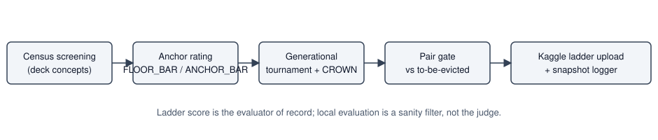
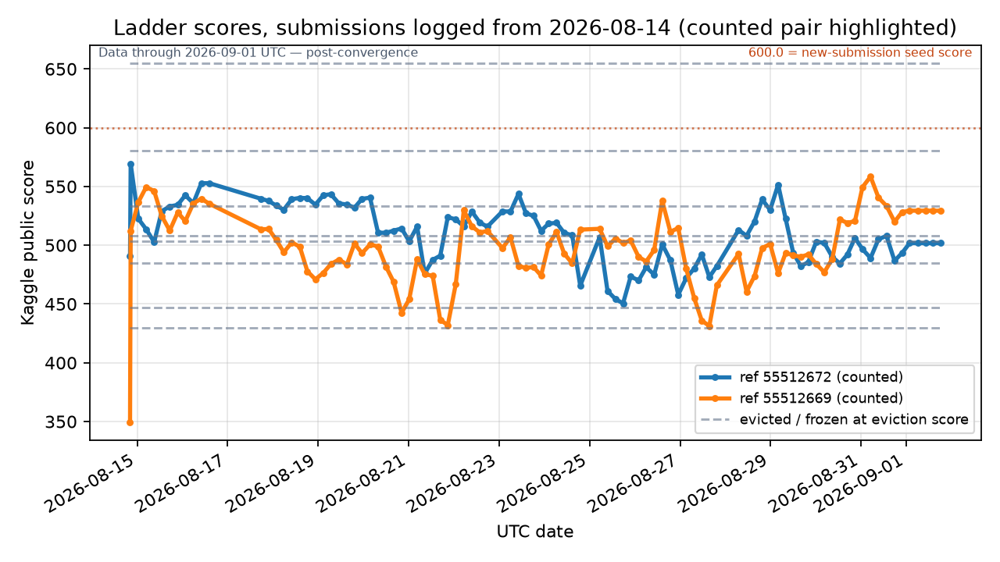

# Pokemon TCG AI Battle Challenge - Strategy Report

## 1. Final Agent & Approach

Our entry is a pair of counted submissions, refs `55512669` and `55512672`, both built by our agent
factory with `agent_kind = search-net`. Each ships a `SearchAgent`: determinized information-set
MCTS on the engine's own forward model, with hidden zones filled by a Belief v2 determinization —
exact accounting for our own zones, mirror-prior sampling for the opponent's, and the face-down
active reserved before the rest is dealt, so no predicted card occupies two zones. The modelled
opponent and the rollout policy are both heuristic-v0 — our hand-written baseline —
and a v0-improvement gate lets search
override v0 only when a challenger move clears a visit floor and a value margin: ref `55512669` runs
the 20 / 0.12 defaults, ref `55512672` the tuned 33 / 0.1539 pair. Leaf positions are scored by a
trained value net — though in neither case was that net trained on the list the agent now plays:
one inherits its parent generation's deck through the net-check lineage, the other is our generic
mixed-policy net. The accurate claim is search plus a trained evaluator, not a deck specialist. Ref
`55512669` is legacy candidate `mega-starmie-water-lean-searchnet v1.0` on
`mega-starmie-water-lean`; ref `55512672` is tournament champion `v0.16` on
`reseed-mega-starmie-water-density20-sv0`.

Every automated factory upload had to clear pre-registered gates — ref `55512672` cleared 0.645
over 200 anchor games, ref `55512669` 0.553 over 150 local games, each a single series, not a
replicated one. The final counted
pair was a deliberate freeze-window decision, not an automated one: because Kaggle counts only
the two most recent submissions and evicts by recency, we hand-picked these two from sustained
ladder evidence and uploaded them through the manual curation path, which bypasses the automated
pair-gate. At convergence the pair rated 529.4 (ref `55512669`) and 501.8 (ref `55512672`).

## 2. Methodology: Hypothesis-Driven Search for an Edge

We treated every proposed improvement as a hypothesis with a pre-registered measurement and an
honest verdict, and let the measurement close the question even when the answer was no.

**Figure F1 — Hypotheses, measurement channels, and outcomes across Slices 2–7B.**

| Slice | Hypothesis tested | Measurement channel | Result | Verdict |
|---|---|---|---|---|
| 2 | Determinized ISMCTS beats heuristic-v0 | Pooled 200- and 50-game acceptance runs | Pooled ~47-49%, no genuine edge | PARITY |
| 4 | A value net beating the hand-tuned evaluator (HTE) offline wins in the arena | Held-out AUC/BCE vs a replicated arena gate (bar 0.55) | AUC 0.8971 net vs 0.7640 HTE; arena pooled 0.498 | FAIL - evaluator not the bottleneck |
| 5 | Search mechanics (thresholds, budget, noise, final-move rule) are the bottleneck | D1-D4 diagnostics plus an F3 selection-rule intervention | No configuration cleared a 95% CI wholly above 0.50 | DEAD-END - no mechanical culprit |
| 6 | Off-policy value blindness explains the residual parity | D0 AUC-deficit diagnostic; two replicated 2x300-game arena gates | Deficit 0.0806 CONFIRMED; post-deviation AUC 0.8168->0.8751 (72% closed) yet arena 0.5017 (301/600); root prior 0.4717 (283/600) | FAIL x2 - evaluator family closed |
| 7A | An exploitable asymmetric deck-pairing edge exists | Pre-registered 12-cell x 150-game pairing test | Differential -0.0078, CI [-0.0540, +0.0384] | FLAT |
| 7B | Imitating search's root visit distribution improves the policy | Gate-1 sanity: class-level policy-net agreement | 0.3067 argmax agreement vs 0.4086 required; class-level 0.4908 vs 0.4071; 46.5% of targets fungible | FAIL at gate 1 - no arena compute spent |

We first established a floor. A hand-written heuristic (heuristic-v0) ranking the engine's offered
legal options beat a random legal-move agent at 0.938 over 500 games, measured with the sample deck
on both sides rather than the ladder list — the reference every later system had to beat.

Lookahead came next. Slice 2 built determinized ISMCTS on the engine's forward model, falling back
to heuristic-v0 on any search failure or timeout so a broken search degrades rather than forfeits.
In the mirror it measured parity.

Parity admits two explanations: the evaluator was too weak for the tree to exploit, or the tree had
nothing to exploit. Slice 4 tested the first, training a value net on 1,326,379 positions from
13,500 v0 self-play games — split 80/20 by game, never by position, so held-out states came from
unseen games — and serving it inside the per-move budget. Offline it dominated the hand-tuned
evaluator; in the arena it changed nothing. Evaluator quality was not the binding constraint.

Slice 5 audited the search machinery instead — iterations against the gate's visit floor, a
time-budget sweep, repeated re-searches from real states to quantify determinization noise, a
gate-off ablation, an alternate final-move rule. Every suspect cleared, so we documented a dead end
rather than spend a replicated gate below the noise floor.

One evaluator hypothesis survived: the net had only seen v0-policy positions, so it could be blind
exactly where search deviates. Slice 6 confirmed that blindness with an evaluator-differential
control separating net-specific error from shared position difficulty, then repaired most of it by
retraining on search-policy data with no on-policy regression. The arena did not move, and promoting
the net from leaf scoring to steering exploration as a root PUCT prior did not move it either.

Slice 7A attacked the symmetry assumption — every prior result came from a mirror matchup — with a
pre-registered asymmetric pairing test whose differential came back flat. Slice 7B tested the last
hypothesis, that modelling both sides as v0 caps what lookahead can surface, by imitating search's
own root visit distribution with a policy net. It failed its sanity gate on every rung of a
pre-registered featurizer ladder, and a class-level analysis explained why: the action space
collapses into very few distinguishable option classes per decision, many of them groups the search
treats as fungible. Per the fail path, no arena compute was spent.

Four channels — arena win rate, offline AUC, deck-asymmetry differential, and policy imitability —
converge: on this benchmark we found no exploitable per-decision edge over a well-tuned heuristic.
That negative result is the finding, and it decided what we shipped.

## 3. The Agent Factory

The factory exists so the selection discipline above runs continuously without a human in the loop.
Its organising principle: the Kaggle ladder is the evaluator of record, and local play is a filter,
never the judge.

Candidates enter through census screening. A persistent tournament database holds every generated
deck concept, and screening rates each against a fixed anchor opponent — heuristic-v0 piloting a
deliberately decoupled deck — rather than against each other, so ratings are absolute, not relative
to a drifting pool. Two legality rules prune the space before a game is played: at least 8 Basic
Pokemon cards per deck, and every non-COLORLESS energy cost of every attack payable from the deck's
own energy types.

Three calibrated gates stand between a new agent and the ladder. An early floor demands 0.46 over 50
anchor games, killing weak lineages at birth; a failing offspring re-picks its deck. The anchor gate
demands 0.60 over 200 games, calibrated against the incumbent lineage's own measured 0.5975, so an
equal-strength challenger passes only about half the time — restrictive by design. Finally, because
Kaggle counts only the two most recent submissions and evicts by recency rather than score, an
ordinary upload can destroy a strong counted submission, so our pair-gate holds every automated
upload to beating the submission it would evict, 0.55 over a 200-game head-to-head. A snapshot
logger then polls the ladder on a 4h floor into an append-only log, so the pair's trajectory is
recorded rather than reconstructed.

**Figure F2 — The agent factory pipeline; the ladder is the evaluator of record.**

## 4. Deck Strategy

Deck choice was decided the same way: by tournament first, then by ladder. Slice 3 ran a 2450-game
persistent-ledger round-robin with heuristic-v0 piloting every list, isolating deck effect from
agent effect. `mega-lucario-fighting` finished field-best at 0.810 with all eight pairings resolved,
ahead of `mega-starmie-water` at 0.781 — and both top decks won while the ledger flagged their
mulligan risk. The pattern did not hold across the field: flagged `mega-mawile-metal` placed sixth
at 0.420, while low-mulligan `mega-lucario-v4` placed third at 0.714. What we kept is narrower: at
the top of this field, a list assembling its one real threat quickly outran smoother lists with
weaker threats.

Then the evaluator of record disagreed with our own tournament. Both counted submissions play the
starmie axis (Figure F3), while `mega-lucario-fighting` survives only as the repository's checked-in
identity deck.

Two rules learned there now gate every generated deck. The Basic-Pokemon floor rests on an exact
hypergeometric opening-hand computation, so mulligan risk is priced rather than guessed. The
payability rule closed a real generator defect: the builder funded only a Pokemon's best attack,
leaving its other attacks unpayable, so a deck could pass card-count legality and still carry dead
text. Rather than cull violators, a deterministic repair pass swaps fillers in place, recovering
most offspring mutation would otherwise waste.

The concept is one Mega Starmie ex power core at maximum search density: Staryu is the only Basic
Pokemon in either list, so the opening rests on the Ball
and Poffin suite backed by Cheren and Judge, Boss's Orders supplies the reach to close, and Night
Stretcher recycles the core. The lists differ only by a density mutation. Both carry four
Basic-Pokemon cards — the mulligan-risky, density-over-consistency shape the tournament kept
selecting, and the shape the later pool rule now pushes away from. The pair predates the rule.

**Figure F4 — Final counted-pair deck composition and key-card roles.**

| Deck | Pokemon | Trainers | Energy | Basics | Key cards & role |
|---|---|---|---|---|---|
| mega-starmie-water-lean (ref 55512669) | 8 | 34 | 18 | 4 | 4x Mega Starmie ex (attacker) + 4x Staryu (its only Basic Pokemon); 4x Ultra Ball, 4x Dusk Ball, 4x Buddy-Buddy Poffin (search); 4x Cheren, 4x Judge, 4x Boss's Orders, 4x Pokegear 3.0 (draw/disruption); 3x Night Stretcher, 2x Switch, 1x Hyper Aroma. |
| reseed-mega-starmie-water-density20-sv0 (ref 55512672) | 8 | 32 | 20 | 4 | Same Mega Starmie ex / Staryu core and search suite; the density-20 mutation trades 2x Switch and 1x Pokegear 3.0 for 2 extra Basic {W} Energy and 1 extra Night Stretcher, holding the core fixed. |

## 5. Consistency, Limitations, Reproducibility

Every gate is a random variable near its bar, so one passing run is not evidence. Our research
gates replicate — Slices 4 and 6 ran 2x300 games — reporting every run and requiring the
interval to clear. The factory's pre-upload gates are weaker: a single 200-game series against a
fixed reference opponent, not a replicated one.

The honest limitation is that result: with no exploitable per-decision edge found, we expect a
mid-band final placement rather than a top rating, and prefer reporting that to dressing a null
result as a win. Neither counted agent runs a value net trained on the deck it plays, and local
evaluation repeatedly failed to predict ladder outcomes; both are real pipeline weaknesses.

The leaderboard played on to convergence after the deadline, roughly 17-31 August, and that
converged rating — not any freeze-day reading — is the result; new submissions seed at 600.0
under boosted early episodes, and an evicted one freezes at its eviction-time score. The converged
scores are 529.4 (ref `55512669`) and 501.8 (ref `55512672`), each flat across the last three of
96 snapshot observations per counted ref logged 2026-08-14 to 2026-09-01.

Everything reproduces from the public repository: census, gates, arena harness and figures are all
scripted, and this report's fact ledger cites a file and line for every number printed here. It will
carry the OSI-approved MIT license the competition requires. The organiser's engine and card data
are license-restricted and not redistributed, so reproduction needs those materials too.

**Code and data:** https://github.com/HIAPPtitude-owner/ptcg-ai-battle-challenge

**Figure F3 — Ladder scores for submissions logged from 2026-08-14; the counted pair is
highlighted. Rendered 2026-09-01, post-convergence.**
